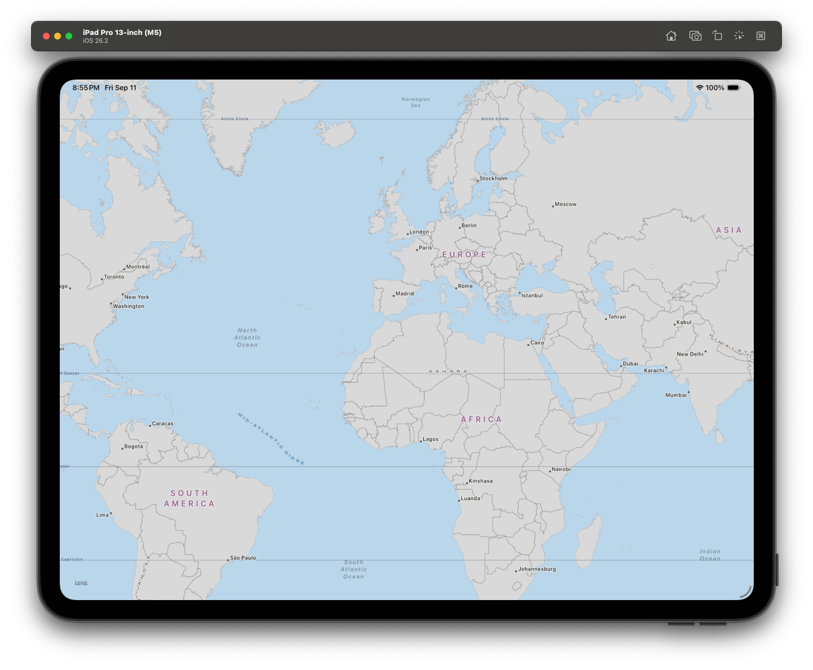

# MapTileKit Example




An example iOS app demonstrating [**MapTileKit**](https://github.com/pulsely/MapTileKit) — a MapKit tile overlay that renders vector tiles from a local MBTiles file, with no dependency on a live network map service. This repository is published as [pulsely/MapTileKit-Example](https://github.com/pulsely/MapTileKit-Example).

The app itself is intentionally minimal — one screen, one `MKMapView`, one `TileOverlay` — so the integration is easy to follow. It originally started life in 2011 as a standalone Objective-C project called `OSMOffline`; it's since been fully rewritten in Swift, and its tile-rendering engine extracted into the standalone `MapTileKit` package this project now exists to demonstrate.

## What it does

The app bundles `countries.mbtiles` — a small [Natural Earth](https://www.naturalearthdata.com/) country/state boundary vector tileset (zoom levels 0–6) — and hands it to `MapTileKit`'s `TileOverlay`, which serves it to a standard `MKMapView` with MapKit's own live network basemap disabled. No network access is required to see the map content: the tiles are read straight out of the bundled SQLite database, decompressed, and rasterized on demand.

For how the tile rendering itself actually works (SQLite lookup, gunzip, vector tile parsing, rasterizing), see [MapTileKit's README](https://github.com/pulsely/MapTileKit) — that logic lives entirely in the package, not this repo.

## Project layout

- **`MapTileKitApp.xcodeproj`** — the example app. Source lives in `MapTileKitApp/`:
  - `AppDelegate.swift` — creates the window and sets `MapViewController` as its root. No storyboard, no XIBs.
  - `MapViewController.swift` — the entire integration example: builds an `MKMapView` in code, loads `countries.mbtiles` from the app bundle, creates a `TileOverlay(mbtilesURL:)`, adds it to the map, and returns a stock `MKTileOverlayRenderer` from its `MKMapViewDelegate`.
  - `countries.mbtiles` — the sample tile data bundled for this demo.
- **[`MapTileKit`](https://github.com/pulsely/MapTileKit)** — the package being demonstrated, pulled in as a remote Swift Package Manager dependency (`from: 1.0.0`). It has no dependency on anything in this repo and is versioned/published independently.

## Building and running

Open `MapTileKitApp.xcodeproj` in Xcode and run the `MapTileKitApp` scheme on a simulator or device (iOS 12+) — Xcode resolves the `MapTileKit` package dependency from GitHub automatically (requires network access for that one-time resolution, even though the app itself runs fully offline afterward).

From the command line:

```sh
xcodebuild -project MapTileKitApp.xcodeproj -scheme MapTileKitApp \
  -sdk iphonesimulator -configuration Debug \
  -destination 'platform=iOS Simulator,name=<Simulator Name>' build
```

**Note:** if you ever see a module resolution error (e.g. "Unable to find module dependency 'MapTileKit'" or "Missing package product 'MapTileKit'") always re-check with a genuinely clean build (Xcode's Product > Clean Build Folder, or a fresh `DerivedData` folder) — incremental builds in this project have been known to report false-positive successes that don't hold up once the package actually needs to rebuild. If a clean build still fails to resolve, check that the `MapTileKit` repository has the tagged version this project depends on actually pushed (`git ls-remote --tags https://github.com/pulsely/MapTileKit.git`).

There is no automated test suite for this project yet.

## Trying your own map data

Swap in any MBTiles file containing gzip-compressed Mapbox Vector Tile data — see [MapTileKit's README](https://github.com/pulsely/MapTileKit#usage) for usage, and its [Known limitations](https://github.com/pulsely/MapTileKit#known-limitations) section (vector tiles only, fixed zoom range, fixed styling).
